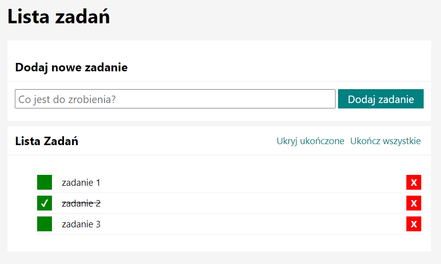

# TASKS LIST
It's just a small homework to test my skill in programing, and show that i can do some simple js coding

The list just adds some tasks to the list, and gives you option to cross the task from the list with a checked button, or delete it at all with a delete button.

All i did was a simple function in java script.

https://michaljanicki26.github.io/LISTA/
